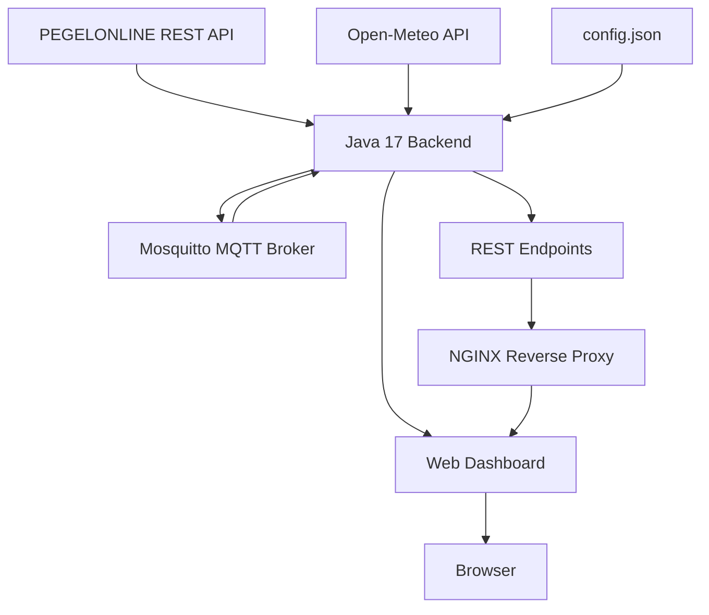

# 02 - Architektur

## Gesamtarchitektur

## Datenpfad Wasserstand

1. `PegelConnectPro` lädt die Laufzeitkonfiguration.
2. `PegelOnlineClient` ruft aktuelle Messwerte ab.
3. Die Messung wird als internes Datenobjekt verarbeitet.
4. Der Trend wird gegen den vorherigen gültigen Wert bestimmt.
5. `ReadingStore` speichert den aktuellen Zustand im Arbeitsspeicher.
6. `MqttGateway` veröffentlicht den Wert auf dem Stations-Topic.
7. `WebServer` stellt den Zustand über REST bereit.
8. NGINX veröffentlicht das Webfrontend und die API auf Port 80 der VM.

## Ports

| Dienst | Gast | Host |
|---|---:|---:|
| Java Backend | 8080 | 8080 |
| Mosquitto MQTT | 1883 | 1885 |
| NGINX | 80 | 8088 |

## Architekturprinzipien

- Externe Konfiguration statt Hardcoding
- Trennung von Datenquelle, Verarbeitung, Messaging und Präsentation
- Reproduzierbares Provisioning
- Fehler sollen lokal behandelt werden und nicht das Gesamtsystem unnötig stoppen
- NGINX entkoppelt Browserzugriff vom Java-Port
